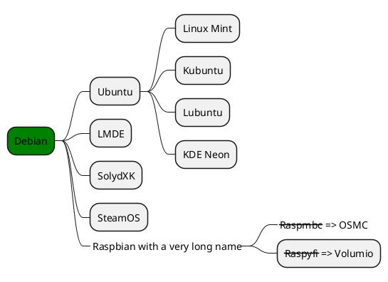
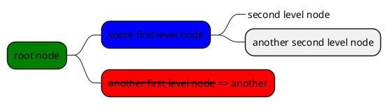

# 语法示例

## Basic Components

### Insert Pictures

<div class='center'>

|1|2|
|:-:|:-:|
|||
</div>

```html
第一种(推荐)：


第二种：


```


### 网页按钮

直接跳转：<a href = "https://www.writebug.com/git/DY130810/Notes/raw/commit/77732e15298f9d2390549ae3a26fd23e5e795d6f/Linear%20Algebra%202/notes/Linear%20Algebra%202%20notes.pdf" ><input type = "button"> a标签，嵌套input </input></a>

直接跳转：<a href="https://www.writebug.com/git/DY130810/Notes/raw/commit/77732e15298f9d2390549ae3a26fd23e5e795d6f/Linear%20Algebra%202/notes/Linear%20Algebra%202%20notes.pdf"><button class="docsify-tabs__tab--active" data-tab="my tab">a标签，嵌套button，自定义颜色</button></a>

直接跳转：<button onclick="window.location.href='pdf/GitHub_YiDingg_pdf/Linear%20Algebra%202%20notes.pdf'" type="button">button标签，window.location.href</button>


打开新窗口：<button onclick="window.open('pdf/GitHub_YiDingg_pdf/Linear%20Algebra%202%20notes.pdf')" type="button">button标签，window.open()</button>

 -->
### 插入音频

网易云音乐生成外链播放器：

<iframe frameborder="no" border="0" marginwidth="0" marginheight="0" width=280 height=52 src="//music.163.com/outchain/player?type=2&id=488249475&auto=0&height=32"></iframe>


### 插入图片

图片用软件 MDTC，自动上传到GitHub图床，手机电脑均可看到图片（无需加速）。  
然后再考虑其他图床：

- [MJJ图床](https://mjj.today/) (手动拖拽+复制，无限制，路径名较长，手机电脑均可访问)
- [路过图床](https://imgse.com/i/pkdTt7F) (手动拖拽+复制，10张图片/h，路径名较短，手机电脑均可访问)

> 不要将图片存到本地目录，这样即使上传/同步到GitHub也无法在博客中访问。

<font color=red size=5 face="黑体">注意：我们不推荐用GitHub作为图床！</font>
<font color=red size=4 face="黑体"> 首先，用GitHub作图床并不符合GitHub创立的初衷，其次仓库大小达到1G后会有人工审核仓库内容，一旦发现仓库被用作图床，可能会删库，也可能会封号！！！</font>

（建议在 800MB 时就新建一个图片仓库，建议在700MB时就新建一个视频仓库）

如果读者不差钱，直接购买各大产商的云对象存储即可，就不用这么来回折腾了，心累心累( •_•)>⌐■-■


### 插入视频

我们希望直接插入博客中国内外均可正常显示的视频，免费方法目前没有找到（2024.6.17更新：已找到，详见图床测试），直接使用GitHub作为视频图床也似乎行不通（国内访问慢或无法访问）。最后选择了国内阿里云（付费，大容量选这个），或SMMS（免费5G，单文件最大5MB）。显然，后者似乎难以满足视频图床的要求（很多视频不止5MB）


- 付费方法（视频访问快）：用GitHub+PicGo+Vercel实现，详见 [【使用Github+Vercel搭建图床并通过自定义域名进行加速你的视频或者图片】](https://www.bilibili.com/video/BV1TH4y1P7f5?vd_source=cc1a55267bfd4977e53958893f16a4a9)

- （尝试失败，目前没有找到免费方法）免费方法（视频访问慢/不能访问）：GitHub+PicGo+JsDelivr，详见[《GitHub+PicGo+JsDelivr 打造高效免费图床详细教程》](https://www.youyuanvip.com/382.html)和[《PicGo图床超强外挂，必须是它！》](https://www.bilibili.com/video/BV1Cs4y1C7yF?vd_source=cc1a55267bfd4977e53958893f16a4a9)

- 阿里云OSS+PicGo(或MDTC)

- [SMMS(国内节点)](https://smms.app/)+PicGo(或MDTC)

<!-- 其它参数说明 -->

```html
video 标签允许多个 source 元素，source 元素可以链接不同的视频文件。浏览器将使用第一个可识别的格式，
 autoplay: 出现该属性意味着视频在就绪后将自动播放，用法：autoplay="autoplay"
controls: 出现该属性意味着向用户显示控件，如播放按钮等，用法：controls="controls"
height: 设置高度     
width:设置宽度
loop:自动重播，用法：loop="loop"
preload: 视频在页面加载时进行加载并预备播放，用法：
        preload="auto" - 当页面加载后载入整个视频；
        preload="meta" - 当页面加载后只载入元数据；
        preload="none" - 当页面加载后不载入视频。
        注意：若使用了autoplay，则忽略preload
src: 要播放视频的url
```


GitHub+gcore：

<div class='center'>
<video controls="false"  muted="muted" id="video1" name="media" style="width:400px"><source src="https://gcore.jsdelivr.net/gh/YiDingg/VideoBank_0/PicGo/202406170046093.mp4" type="video/mp4"></video>
</div>

### 视频转GIF后插入

在线转换推荐：[convertio](https://convertio.co/zh/)，事实上 convertio 是个万能转换器，支持超多音频/视频/图像/文档/电子书格式。
软件转换推荐：[开源软件：screentogif](https://www.screentogif.com/)。它们都是免费的。

然后利用MDTC上传到GitHub图床，直接插入即可：


注意：视频转GIF可能会使文件大小骤增。

上面的视频原为4.5MB/60fps，在线转换后41MB/60fps，软件默认配置转换后24MB/60fps。网页转换不可调帧率/画质，软件转换的画质更高且可以调低，最低和视频原大小相近，但观感也会受影响。

### 字体种类颜色大小

<font color=red size=3 face="黑体">我是红色，黑色字体，大小是3</font>

[markdown文字居中以及尺寸颜色设置](https://blog.csdn.net/abcdef314159/article/details/117886276)


### 网页里居中表格

表格居中需要配置html：

```html
<style>
	.center 
	{
	width: auto;
	display: table;
	margin-left: auto;
	margin-right: auto;
	}
</style>
```


<p align="center"><font face="华文彩云" size=2.>表1 居中表格</font></p>
<div class="center">

| 序号  | 偏移  |   说明   |
| :---: | :---: | :------: |
|   1   |   0   | 表格说明 |
|   2   |   2   | 表格说明 |
|   3   |   4   | 表格说明 |
</div>

```html
<p align="center"><font face="黑体" size=2.>表1 居中表格</font></p>
<div class="center">

| 序号  | 偏移  |   说明   |
| :---: | :---: | :------: |
|   1   |   0   | 表格说明 |
|   2   |   2   | 表格说明 |
|   3   |   4   | 表格说明 |
</div>

```


### 手风琴

<details>
<summary>Self-assessment (Click to expand)</summary>

- Abc
- Abc

</details>

```html
<details>
<summary>Self-assessment (Click to expand)</summary>

- Abc
- Abc

</details>
```

<font style="color:blue;font-size:3px;"> 设置颜色、字号（网页都有）ddddddddddd</font>  
<font style="color:red;font-size:20px;"> 设置颜色、字号ddddddddddd</font>  

```html
<font style="color:blue;font-size:3px;"> 设置颜色、字号（网页都有）ddddddddddd</font>  
<font style="color:red;font-size:20px;"> 设置颜色、字号ddddddddddd</font>  
```


<div style='color: red'>

- listitem
- listitem
- listitem
  

</div> 

```html
<div style='color: red'>

- listitem
- listitem
- listitem

</div> 
```

>[!TIP]
推荐B站up主“程序猫大刚”的docsify视频：[https://www.bilibili.com/video/BV1UT411272V/](https://www.bilibili.com/video/BV1UT411272V/)<br>
数十个docsify视频，带你从搭建到完善，不错哦！

<br>

>[!TIP]docsify的相关插件多以 `docsify-插件名字` 为格式，在GitHub搜索相关repo即可。


## 外接插件

### docsify自带

* [ ] hi
* [ ] hi
- [x] hi
- [x] hi
* [ ] hi

```html
* [ ] hi

- [x] hi
```

### Latex公式

$x = \frac{y}{x^2}$
$$
y = x^2
$$
```html
$x = \frac{y}{x^2}$
$$
y = x^2
$$
```


### tab选项卡插件

具体设置见：https://jhildenbiddle.github.io/docsify-tabs/#/

<!-- tabs:start -->
#### **English**
Hello!  （代码里必须有对应注释）
<font style="color:red;font-size:20px;"> 这里也可以ddddddddddd</font>  


#### **French氺**
Bonjour!
<!-- tabs:end -->
```html
<!-- tabs:start -->
#### **English**
Hello!  （代码里必须有对应注释）
<font style="color:red;font-size:20px;"> 这里也可以ddddddddddd</font>  
#### **French氺**
Bonjour!
<!-- tabs:end -->
```

<!-- tabs:start -->

#### **:smile:**
how about this?

#### **<span style="color: red;">Red</span>**
this?

#### **Badge <span class="tab-badge">New!</span>**
and this?

<!-- tabs:end -->

```html
<!-- tabs:start -->

#### **:smile:**
how about this?

#### **<span style="color: red;">Red</span>**
this?

#### **Badge <span class="tab-badge">New!</span>**
and this?

<!-- tabs:end -->
```


<!-- tabs:start -->


<!-- tabs:start -->
<a href="">
    <button class="docsify-tabs__tab--active" data-tab="my tab">点击跳转</button>
</a>

#### **Active State**
this is also beautiful


#### **Wow!**
and you can costum the styles

<!-- tabs:end -->


### alerts插件

>[!TIP]
>An alert of type 'tip' using global style 'callout'

>[!NOTE]
>An alert of type 'note' using global style 'callout'.

>[!WARNING]
>An alert of type 'warning' using global style 'callout'.

>[!ATTENTION]
>An alert of type 'attention' using global style 'callout'

```html
>[!TIP]
>An alert of type 'tip' using global style 'callout'

>[!NOTE]
>An alert of type 'note' using global style 'callout'.

>[!WARNING]
>An alert of type 'warning' using global style 'callout'.

>[!ATTENTION]
>An alert of type 'attention' using global style 'callout'

```
configurations 详见：https://github.com/fzankl/docsify-plugin-flexible-alerts

### plantuml画图集成
官网：https://plantuml.com/zh/
```plantuml
Alice -> Bob: Authentication Request
Bob --> Alice: Authentication Response
Alice -> Bob: Another authentication Request
Alice <--- Bob: Another authentication Response
```

````html

```plantuml
Alice -> Bob: Authentication Request
Bob --> Alice: Authentication Response
Alice -> Bob: Another authentication Request
Alice <--- Bob: Another authentication Response
```

````



````html

````

上面是用OrgMode 语法，下面用markdown语法：


````html

````

在VSCode中，光标放在代码块，Alt+D预览plantuml图


### html预览(不行)
```
<p>Hello!</p>
```

### 嵌入md文件(不行)

[markdown](https://www.writebug.com/git/DY130810/DataBank_UngYears/raw/commit/0da5619ef612e106759e79afce678486ae17b93a/test/%E8%AF%AD%E6%B3%95%E7%A4%BA%E4%BE%8B%EF%BC%9A.md ':include  :type=iframe')

```html
[rmd2](https://github.com/YiDingg/YiDingg/blob/main/README.md)
```

### 嵌入pdf文件

已经做过的尝试

<div class='center'>

|方法|引用src|移动端|PC端|
| :-: | :-: | :-: | :-: |
| docsify-pdf-embed-plugin | 本地相对路径 | X | V |
| docsify-pdf-embed-plugin | GitHub | X | X |
| docsify-pdf-embed-plugin | Gittee | X | X |
| docsify-pdf-embed-plugin | WB | X | V |
| docsify-pdf-embed-plugin | 腾讯云 | 能下载但不显示 | 能下载但不显示 |
| iframe | 本地相对路径 | X | V |
| iframe | GitHub | X | X |
| iframe | Gittee | X | X |
| iframe | WB | X | V |
| iframe | 腾讯云 | 能下载但不显示 | 能下载但不显示 |
</div>

其中，引用scr为WB时速度最快，也是本网站目前采用的方法(2024.6.17)。

另外，iframe在手机端可能会直接唤起下载请求，因此建议使用插件。

````html
iframe:
<iframe src="这里是WB绝对路径或本地相对路径" width="800px" height="300px" frameborder="0" scrolling="no"></iframe>

插件
```pdf
这里是WB绝对路径或本地相对路径
```
````


插件+WB：
```pdf
https://www.writebug.com/git/DY130810/GitHub_YiDingg_pdf/raw/branch/main/Linear%20Algebra%202%20notes.pdf
```

### 嵌入docsify

[docsify](https://yidingg.github.io/YiDingg/#/Blogs/STM32/STM32%E7%B3%BB%E5%88%97%E6%B1%87%E6%80%BB ':include :type=iframe id=a1 width=100% height=400px')

其实也可以用来嵌入代码：

[docsify](https://www.writebug.com/git/DY130810/DataBank_UngYears/raw/commit/0da5619ef612e106759e79afce678486ae17b93a/test/%E8%AF%AD%E6%B3%95%E7%A4%BA%E4%BE%8B%EF%BC%9A.md ':include :type=iframe id=a1 width=100% height=200px')

```html
[docsify](https://yidingg.github.io/YiDingg/#/Blogs/STM32/STM32%E7%B3%BB%E5%88%97%E6%B1%87%E6%80%BB ':include :type=iframe id=a1 width=100% height=400px')

[docsify](https://www.writebug.com/git/DY130810/DataBank_UngYears/raw/commit/0da5619ef612e106759e79afce678486ae17b93a/test/%E8%AF%AD%E6%B3%95%E7%A4%BA%E4%BE%8B%EF%BC%9A.md ':include :type=iframe id=a1 width=100% height=200px')
```

### panels分栏(冲突)

```html
 <!-- panels:start -->

(...) - Awesome div wrapper

 <!-- panels:end -->
```

### fontawesome

<i class="fas fa-home fa-fw"></i>
<i class="fas fa-th-list fa-fw"></i>
<i class="fab fa-linux fa-fw"></i>
<i class="fab fa-aws fa-fw"></i>

```html
<i class="fas fa-home fa-fw"></i>
<i class="fas fa-th-list fa-fw"></i>
<i class="fab fa-linux fa-fw"></i>
<i class="fab fa-aws fa-fw"></i>
```

### docker-docsify-pdf

https://github.com/kernoeb/docker-docsify-pdf

### docsify-chat

https://github.com/xueelf/docsify-chat

<!-- chat:start -->

<!-- title:yuki's chat history -->

#### **kokkoro**

hello

#### **yuki**

hello world

#### **Yi Ding**

welcome!

<!-- chat:end -->

### docsify-corner

https://github.com/Koooooo-7/docsify-corner


### docsify-gifcontrol(太慢)

gif较大时加载很慢，40MB约60s，无加速时可能加载不出来，因此不使用


### docsify-terminal-block


```terminal
npm run start
$|npm run start
$|warning|npm run build
>|info|npm run start
	|...
>|error|npm run start
>|success|npm run start

warning|npm run build
```

### docsify-accordion

手风琴插件：

Introduction text for the FAQ page.

+ Question 1? +

  Answer 1

+ Question 2? +

  Answer 2

### docsify-search-plugin

https://github.com/peterbedorjr/docsify-algolia-search-plugin

暂时用的另一个：
//cdn.jsdelivr.net/npm/docsify/lib/plugins/search.min.js


### docsify-term 代码动画插件(不行)

```term
$ php -v
PHP 7.3.23 (cli) (built: Apr 20 2022 15:59:45) ( NTS )
Copyright (c) 1997-2018 The PHP Group
Zend Engine v3.3.23, Copyright (c) 1998-2018 Zend Technologies

# 这个一个选择 (y/n) $ y
// 这是注释
$ pip install fastapi
>> 100%
```

### 