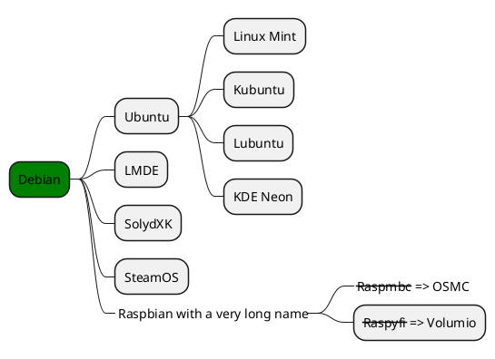
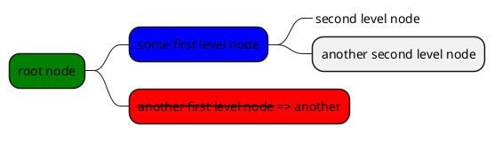

<div style="text-align:center">
<audio id='Music-1' controls>
    <source src="https://imagebank-0.oss-cn-beijing.aliyuncs.com/VS-PicGo/Syntax Examples--2024-06-22-01-24-43.mp3" type="audio/mpeg">
    Your browser does not support the audio element.
</audio>
</div>

## Plugins

- Go to https://docsify.js.org/#/awesome?id=plugins for more great plugins related to docsify.

### docsify

https://docsify.js.org

!> **<span style='color:red'>Attention:</span>**<br>
Converting video to gif with high quality might cause a size surge. 

?> **<span style='color:green'>Attention:</span>**<br>
Converting video to gif with high quality might cause a size surge. 

### Katex

$x = \frac{y}{x^2}$
$$
y = x^2
$$

```html
$x = \frac{y}{x^2}$
$$
y = x^2
$$
```

###  Tabs

https://jhildenbiddle.github.io/docsify-tabs/#/

<!-- tabs:start -->
#### **:smile:**
how about this?
#### **<span style="color: red;">Red</span>**
this?
#### **Badge <span class="tab-badge">New!!!!!!!!</span>**
and this?
<!-- tabs:end -->

<!-- tabs:start -->
#### **Active State**
this is also beautiful
#### **Wow!**
and you can costum the styles
<!-- tabs:end -->


```html
<!-- tabs:start -->
#### **:smile:**
how about this?
#### **<span style="color: red;">Red</span>**
this?
#### **Badge <span class="tab-badge">New!</span>**
and this?
<!-- tabs:end -->

<!-- tabs:start -->
#### **Active State**
this is also beautiful
#### **Wow!**
and you can costum the styles
<!-- tabs:end -->
```

### Alerts

https://github.com/fzankl/docsify-plugin-flexible-alerts

>[!TIP]
An alert of type 'tip' using global style 'callout'

> [!TIP|style:flat|label:My own heading|iconVisibility:hidden]
An alert of type 'tip' using alert specific style 'flat' which overrides global style 'callout'.In addition, this alert uses an own heading and hides specific icon.

>[!NOTE]
An alert of type 'note' using global style 'callout'.

>[!WARNING]
An alert of type 'warning' using global style 'callout'.

>[!ATTENTION]
An alert of type 'attention' using global style 'callout'

```html
>[!TIP]
An alert of type 'tip' using global style 'callout'

> [!TIP|style:flat|label:My own heading|iconVisibility:hidden]
An alert of type 'tip' using alert specific style 'flat' which overrides global style 'callout'.In addition, this alert uses an own heading and hides specific icon.

>[!NOTE]
An alert of type 'note' using global style 'callout'.

>[!WARNING]
An alert of type 'warning' using global style 'callout'.

>[!ATTENTION]
An alert of type 'attention' using global style 'callout'
```


### Gifcontrol

https://gbodigital.github.io/docsify-gifcontrol

Click to play, click again to pause (using inline option):


### <s>Panels</s>

https://vagnerdomingues.github.io/docsify-example-panels

<!-- panels:start -->
<!-- div:title-panel -->
  (...) - Awesome title
<!-- div:left-panel -->
  (...) - Awesome explanation
<!-- div:right-panel -->
  (...) - Awesome example
<!-- panels:end -->

### Footer-enh

At the end of the page:


### Plantuml

https://github.com/imyelo/docsify-plantuml  
https://plantuml.com/ (English)  
https://plantuml.com/zh/ (中文)

OrgMode syntax:

```plantuml
Alice -> Bob: Authentication Request
Bob --> Alice: Authentication Response
Alice -> Bob: Another authentication Request
Alice <--- Bob: Another authentication Response
```

````html
```plantuml
Alice -> Bob: Authentication Request
Bob --> Alice: Authentication Response
Alice -> Bob: Another authentication Request
Alice <--- Bob: Another authentication Response
```
````



````html

````

Markdown syntax:



````html

````

### Markdown-embed

https://github.com/JerryC8080/docsify-remote-markdown


```html
<div style='border:#000 solid 1px; width:100%;'>
[remoteMarkdownUrl](https://raw.githubusercontent.com/YiDingg/OLEDSD/d93810cd247ef8cc883205b9d545d941eb7785a8/README.md)
</div>
```


### PDF-embed

https://github.com/lazypanda10117/docsify-pdf-embed


<!-- <div class='center'>

|方法|引用src|移动端|PC端|
| :-: | :-: | :-: | :-: |
| docsify-pdf-embed-plugin | 本地相对路径 | X | V |
| docsify-pdf-embed-plugin | GitHub | X | X |
| docsify-pdf-embed-plugin | Gittee | X | X |
| docsify-pdf-embed-plugin | WB | X | V |
| docsify-pdf-embed-plugin | 腾讯云 | 能下载但不显示 | 能下载但不显示 |
| iframe | 本地相对路径 | X | V |
| iframe | GitHub | X | X |
| iframe | Gittee | X | X |
| iframe | WB | X | V |
| iframe | 腾讯云 | 能下载但不显示 | 能下载但不显示 |
</div> -->

[Demo](http://localhost:3000/#/Notes\Math\Linear%20Algebra%201%20notes)

````html
```pdf
here is the path
```
<iframe src="here is the path" width="800px" height="300px" frameborder="0" scrolling="no"></iframe>
````


### docsify-embed

[docsify](https://yidingg.github.io/YiDingg/#/Blogs/STM32/STM32%E7%B3%BB%E5%88%97%E6%B1%87%E6%80%BB ':include :type=iframe width=100% height=400px')

To embed code:

[docsify](https://www.writebug.com/git/DY130810/DataBank_UngYears/raw/commit/0da5619ef612e106759e79afce678486ae17b93a/test/%E8%AF%AD%E6%B3%95%E7%A4%BA%E4%BE%8B%EF%BC%9A.md ':include :type=iframe width=100% height=200px')

```html
[docsify](https://yidingg.github.io/YiDingg/#/Blogs/STM32/STM32%E7%B3%BB%E5%88%97%E6%B1%87%E6%80%BB ':include :type=iframe id=a1 width=100% height=400px')

[docsify](https://www.writebug.com/git/DY130810/DataBank_UngYears/raw/commit/0da5619ef612e106759e79afce678486ae17b93a/test/%E8%AF%AD%E6%B3%95%E7%A4%BA%E4%BE%8B%EF%BC%9A.md ':include :type=iframe id=a1 width=100% height=200px')
```

### <s>Top-banner</s>

https://github.com/Plugin-contrib/docsify-plugin/tree/master/packages/docsify-top-banner-plugin


### Awesome Icon

<i class="fas fa-home fa-fw"></i>
<i class="fas fa-th-list fa-fw"></i>
<i class="fab fa-linux fa-fw"></i>
<i class="fab fa-aws fa-fw"></i>

```html
<i class="fas fa-home fa-fw"></i>
<i class="fas fa-th-list fa-fw"></i>
<i class="fab fa-linux fa-fw"></i>
<i class="fab fa-aws fa-fw"></i>
```

### Chat

https://github.com/xueelf/docsify-chat

<!-- chat:start -->
<!-- title:yuki's chat history -->
#### **kokkoro**
hello
#### **yuki**
hello world
#### **Yi Ding**
welcome!
<!-- chat:end -->


### <s>Sidebar footer</s>

https://github.com/markbattistella/docsify-sidebar-footer

### Corner

https://github.com/Koooooo-7/docsify-corner


### Terminal Block


```terminal
npm run start
$|npm run start
$|warning|npm run build
>|info|npm run start
	|...
>|error|npm run start
>|success|npm run start

warning|npm run build
```

### Accordion

https://github.com/isaozler/docsify-accordion

Introduction text for the FAQ page.

+ Question 1? +

  Answer 1

+ Question 2? +

  Answer 2

### Search-plugin

https://github.com/peterbedorjr/docsify-algolia-search-plugin

暂时用的另一个：
//cdn.jsdelivr.net/npm/docsify/lib/plugins/search.min.js


### <s>Termynal</s>

https://github.com/sxin0/docsify-termynal

```term
$ php -v
PHP 7.3.23 (cli) (built: Apr 20 2022 15:59:45) ( NTS )
Copyright (c) 1997-2018 The PHP Group
Zend Engine v3.3.23, Copyright (c) 1998-2018 Zend Technologies

# 这个一个选择 (y/n) $ y
// 这是注释
$ pip install fastapi
>> 100%
```

### Material Icons

https://github.com/erickjx/docsify-material-icons  
https://mui.com/material-ui/material-icons/

<i class="material-icons-two-tone">check_circle</i>
<i style="color: red" class="material-icons">face</i>
<i class="material-icons md-18">delete</i> 
<i class="material-icons-two-tone md-18">delete</i> 
<i class="material-icons-sharp md-light md-36 md-light">delete</i>
<i class="material-icons-outlined md-light md-36 md-light">delete</i>
<i class="material-icons-outlined md-light md-36 md-light" style='font-size:36px'>delete</i>
<i class="material-icons md-light md-36 md-light">access_time</i>

<div class='center'>

</div>


```html
<i class="material-icons-two-tone">check_circle</i>
<i style="color: red" class="material-icons">face</i>
<i class="material-icons md-18">delete</i> 
<i class="material-icons-two-tone md-18">delete</i> 
<i class="material-icons-sharp md-light md-36 md-light">delete</i>
<i class="material-icons-outlined md-light md-36 md-light">delete</i>
<i class="material-icons md-light md-36 md-light">access_time</i>
```

### Hello