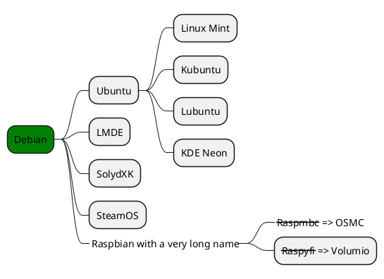
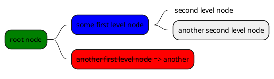

>[!TIP]
>推荐B站up主“程序猫大刚”的docsify视频：[https://www.bilibili.com/video/BV1UT411272V/](https://www.bilibili.com/video/BV1UT411272V/)<br>
>数十个docsify视频，带你从搭建到完善，不错哦！

## Markdown与HTML语法

[markdown文字居中以及尺寸颜色设置](https://blog.csdn.net/abcdef314159/article/details/117886276)

表格居中需要配置html：
```html
<style>
	.center 
	{
	width: auto;
	display: table;
	margin-left: auto;
	margin-right: auto;
	}
</style>
```


<p align="center"><font face="华文彩云" size=2.>表1 居中表格</font></p>
<div class="center">

| 序号  | 偏移  |   说明   |
| :---: | :---: | :------: |
|   1   |   0   | 表格说明 |
|   2   |   2   | 表格说明 |
|   3   |   4   | 表格说明 |
</div>

```html
<p align="center"><font face="黑体" size=2.>表1 居中表格</font></p>
<div class="center">

| 序号  | 偏移  |   说明   |
| :---: | :---: | :------: |
|   1   |   0   | 表格说明 |
|   2   |   2   | 表格说明 |
|   3   |   4   | 表格说明 |
</div>

```

<details>
<summary>Self-assessment (Click to expand)</summary>

- Abc
- Abc

</details>

```html
<details>
<summary>Self-assessment (Click to expand)</summary>

- Abc
- Abc

</details>
```

<font style="color:blue;font-size:3px;"> 设置颜色、字号（网页都有）ddddddddddd</font>  
<font style="color:red;font-size:20px;"> 设置颜色、字号ddddddddddd</font>  
```html
<font style="color:blue;font-size:3px;"> 设置颜色、字号（网页都有）ddddddddddd</font>  
<font style="color:red;font-size:20px;"> 设置颜色、字号ddddddddddd</font>  
```
<div style='color: red'>

- listitem
- listitem
- listitem
  
</div> 

```html
<div style='color: red'>

- listitem
- listitem
- listitem

</div> 
```

## Latex公式

$x = \frac{y}{x^2}$
$$
y = x^2
$$
```html
$x = \frac{y}{x^2}$
$$
y = x^2
$$
```


## docsify自带

* [ ] hi
* [ ] hi
- [x] hi
- [x] hi
* [ ] hi

```html
* [ ] hi

- [x] hi
```

## tab选项卡插件
<!-- tabs:start -->
#### **English**
Hello!  （代码里必须有对应注释）
<font style="color:red;font-size:20px;"> 这里也可以ddddddddddd</font>  
#### **French氺**
Bonjour!
<!-- tabs:end -->
```html
<!-- tabs:start -->
#### **English**
Hello!  （代码里必须有对应注释）
<font style="color:red;font-size:20px;"> 这里也可以ddddddddddd</font>  
#### **French氺**
Bonjour!
<!-- tabs:end -->
```

## alerts插件

>[!TIP]
>An alert of type 'tip' using global style 'callout'

>[!NOTE]
>An alert of type 'note' using global style 'callout'.

>[!WARNING]
>An alert of type 'warning' using global style 'callout'.

>[!ATTENTION]
>An alert of type 'attention' using global style 'callout'

```html
>[!TIP]
>An alert of type 'tip' using global style 'callout'

>[!NOTE]
>An alert of type 'note' using global style 'callout'.

>[!WARNING]
>An alert of type 'warning' using global style 'callout'.

>[!ATTENTION]
>An alert of type 'attention' using global style 'callout'

```


## plantuml画图集成
官网：https://plantuml.com/zh/
```plantuml
Alice -> Bob: Authentication Request
Bob --> Alice: Authentication Response
Alice -> Bob: Another authentication Request
Alice <--- Bob: Another authentication Response
```

```html

```plantuml
Alice -> Bob: Authentication Request
Bob --> Alice: Authentication Response
Alice -> Bob: Another authentication Request
Alice <--- Bob: Another authentication Response
(代码块结束)```

```



```html


上面是用OrgMode 语法，下面用markdown语法：


```html


在VSCode中，光标放在代码块，Alt+D预览plantuml图


## 手风琴插件(不行)


+ 问题1？ +
   答案1

好像不行？
  答案2


## html预览demo(不行)
```
<p>Hello!</p>
```


## 嵌入远程md文件(不行)

[markdown](https://www.writebug.com/git/DY130810/DataBank_UngYears/raw/commit/0da5619ef612e106759e79afce678486ae17b93a/test/%E8%AF%AD%E6%B3%95%E7%A4%BA%E4%BE%8B%EF%BC%9A.md ':include  :type=iframe')

```html
[rmd2](https://github.com/YiDingg/YiDingg/blob/main/README.md)
```

## 嵌入pdf文件

```pdf
	pdf/Linear%20Algebra%202%20notes.pdf
```

```pdf
	https://www.writebug.com/git/DY130810/Notes/raw/commit/77732e15298f9d2390549ae3a26fd23e5e795d6f/Linear%20Algebra%202/notes/Linear%20Algebra%202%20notes.pdf
```

```html
```pdf
	pdf文件绝对路径/相对路径(都可以)
(代码块结束)```

```

## 嵌入docsify

[docsify](https://yidingg.github.io/YiDingg/#/Blogs/STM32/STM32%E7%B3%BB%E5%88%97%E6%B1%87%E6%80%BB ':include :type=iframe id=a1 width=100% height=400px')

其实也可以用来嵌入代码：

[docsify](https://www.writebug.com/git/DY130810/DataBank_UngYears/raw/commit/0da5619ef612e106759e79afce678486ae17b93a/test/%E8%AF%AD%E6%B3%95%E7%A4%BA%E4%BE%8B%EF%BC%9A.md ':include :type=iframe id=a1 width=100% height=200px')

```html
[docsify](https://yidingg.github.io/YiDingg/#/Blogs/STM32/STM32%E7%B3%BB%E5%88%97%E6%B1%87%E6%80%BB ':include :type=iframe id=a1 width=100% height=400px')

[docsify](https://www.writebug.com/git/DY130810/DataBank_UngYears/raw/commit/0da5619ef612e106759e79afce678486ae17b93a/test/%E8%AF%AD%E6%B3%95%E7%A4%BA%E4%BE%8B%EF%BC%9A.md ':include :type=iframe id=a1 width=100% height=200px')
```

## 嵌入mp3音频

```html
[这里随意](绝对路径 ':include :type=audio')
```