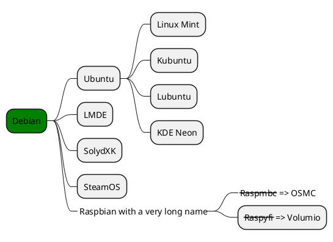
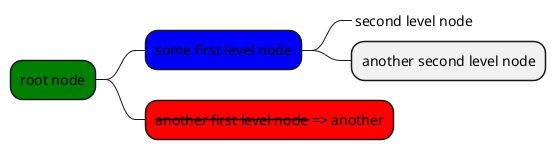

>[!TIP]
>推荐B站up主“程序猫大刚”的docsify视频：[https://www.bilibili.com/video/BV1UT411272V/](https://www.bilibili.com/video/BV1UT411272V/)<br>
>数十个docsify视频，带你从搭建到完善，不错哦！

## 网页自带
<font style="color:blue;font-size:3px;"> 设置颜色、字号（网页都有）ddddddddddd</font>  
<font style="color:red;font-size:20px;"> 设置颜色、字号ddddddddddd</font>  
```html
<font style="color:blue;font-size:3px;"> 设置颜色、字号（网页都有）ddddddddddd</font>  
<font style="color:red;font-size:20px;"> 设置颜色、字号ddddddddddd</font>  
```
<div style='color: red'>

- listitem
- listitem
- listitem
  
</div> 

```html
<div style='color: red'>

- listitem
- listitem
- listitem

</div> 
```

## docsify自带

* [ ] hi
* [ ] hi
- [x] hi
- [x] hi
* [ ] hi

```html
* [ ] hi

- [x] hi
```


## tab选项卡插件
<!-- tabs:start -->
#### **English**
Hello!  （代码里必须有对应注释）
<font style="color:red;font-size:20px;"> 这里也可以ddddddddddd</font>  
#### **French氺**
Bonjour!
<!-- tabs:end -->
```html
<!-- tabs:start -->
#### **English**
Hello!  （代码里必须有对应注释）
<font style="color:red;font-size:20px;"> 这里也可以ddddddddddd</font>  
#### **French氺**
Bonjour!
<!-- tabs:end -->
```

## alerts插件

>[!TIP]
>An alert of type 'tip' using global style 'callout'

>[!NOTE]
>An alert of type 'note' using global style 'callout'.

>[!WARNING]
>An alert of type 'warning' using global style 'callout'.

>[!ATTENTION]
>An alert of type 'attention' using global style 'callout'

```html
>[!TIP]
>An alert of type 'tip' using global style 'callout'

>[!NOTE]
>An alert of type 'note' using global style 'callout'.

>[!WARNING]
>An alert of type 'warning' using global style 'callout'.

>[!ATTENTION]
>An alert of type 'attention' using global style 'callout'

```


## plantuml画图集成
官网：https://plantuml.com/zh/
```plantuml
Alice -> Bob: Authentication Request
Bob --> Alice: Authentication Response
Alice -> Bob: Another authentication Request
Alice <--- Bob: Another authentication Response
```

```html

```plantuml
Alice -> Bob: Authentication Request
Bob --> Alice: Authentication Response
Alice -> Bob: Another authentication Request
Alice <--- Bob: Another authentication Response
(代码块结束)```

```



```html


上面是用OrgMode 语法，下面用markdown语法：


```html


在VSCode中，光标放在代码块，Alt+D预览plantuml图


## 手风琴插件(不行)


+ 问题1？ +
   答案1

好像不行？
  答案2


## html预览demo(不行)
```
<p>Hello!</p>
```


## 嵌入远程md文件(不行)

[rmd2](https://github.com/YiDingg/YiDingg/blob/main/README.md)

```html
[rmd2](https://github.com/YiDingg/YiDingg/blob/main/README.md)
```

## 内嵌显示pdf文件

```pdf
	pdf/Linear%20Algebra%202%20notes.pdf
```

```pdf
	https://www.writebug.com/git/DY130810/Notes/raw/commit/77732e15298f9d2390549ae3a26fd23e5e795d6f/Linear%20Algebra%202/notes/Linear%20Algebra%202%20notes.pdf
```

```html
```pdf
	pdf文件绝对路径/相对路径(都可以)
(代码块结束)```


```
